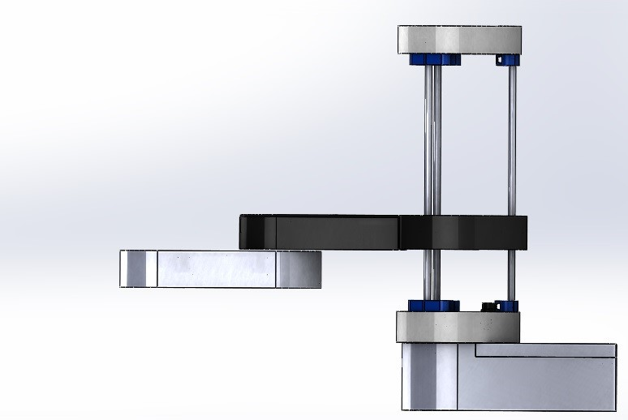
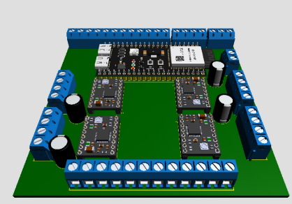
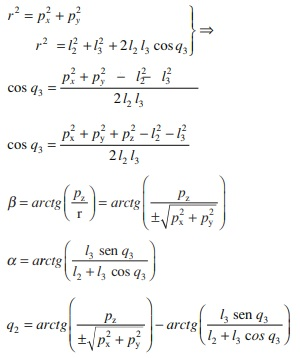
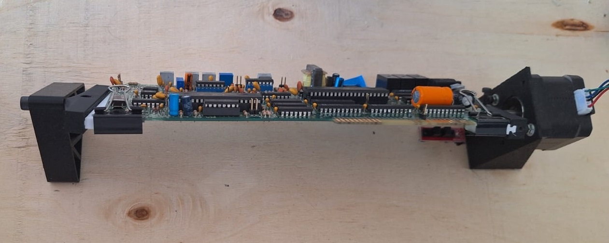
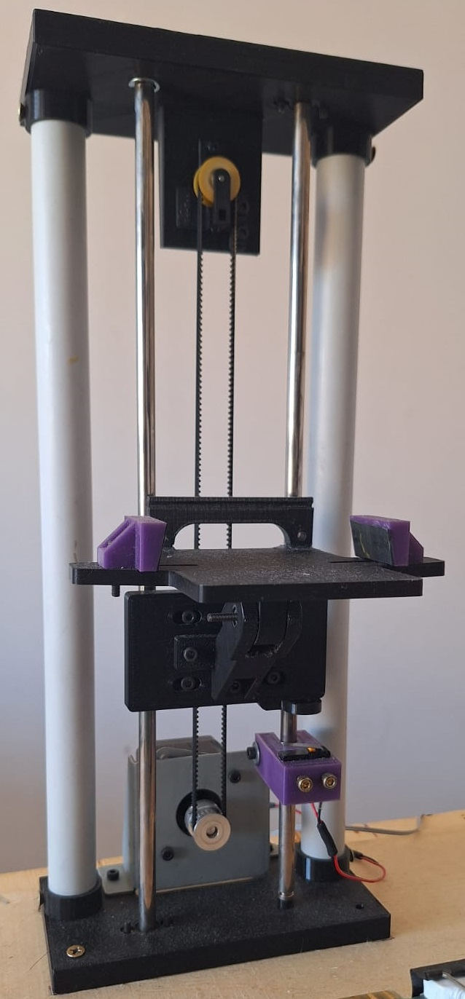
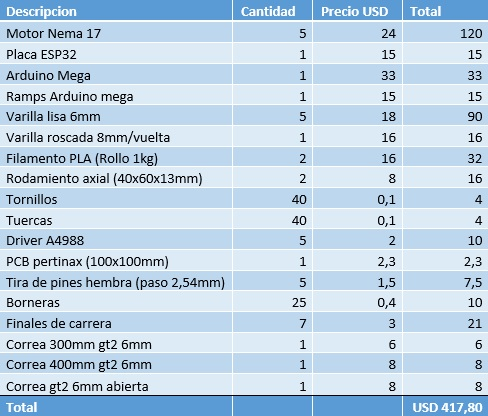

<h1 align="center">Análisis de fallas en placas electrónicas</h1>


# Detalle del trabajo realizado

El trabajo que realicé es un dispositivo mecatrónico que inspecciona placas electrónicas mediante una cámara y un robot, para luego informar las fallas detectadas. Está pensado para recibir placas electrónicas al final de una línea de producción y verificar que las mismas cuenten con las necesidades mínimas para ser aprobadas, controlando tanto los diferentes elementos electrónicos como los errores de soldadura mediante una cámara y realizando mediciones sobre la placa a través de un robot SCARA. El resultado de estos tres análisis es el que corroborará si placa está o no en condiciones para pasar dicho control de calidad. Todo esto será controlado a través de una interfaz gráfica desarrollada en Python, donde también se podrá observar en tiempo real las diferentes detecciones y mediciones realizadas sobre la placa. 

# Elementos Móviles
El prototipo está formado por tres elementos móviles, y si bien todos se controlan mediante placas electrónicas tipo Arduino estos elementos están integrados mediante un programa de Python para que coordinen sus movimientos y analicen las diferentes placas. Estos elementos son: un robot de tipo SCARA, la base porta placa y un elevador.
# Robot SCARA
El robot SCARA diseñado íntegramente en SOLIDWORKS e impreso con impresora 3D, es de tres grados de libertad (dos giros y un desplazamiento lineal). Este será el encardo de realizar los movimientos necesarios para posicionarse en los puntos de testeo de las placas, y gracias a su efector (puntas de medición) tomará las mediciones correspondientes. Medirá continuidad entre los puntos de testeo de la placa, y se tomarán como válidas las placas que presenten continuidad sobre esos puntos. 
Dicho robot está formado por tres mecanismos móviles (la base, el brazo, regulación de altura) y cada uno cuenta con un motor paso a paso nema 17 que es el encargado de darle el movimiento a cada mecanismo. La base es giratoria y está formada por dos rodamientos axiales de 60mm de diámetro exterior, los cuales acoplan mediante tornillos y tuercas a una polea dentada de 60 dientes, dicha polea acopla a otra polea de 20 dientes a 150mm de distancia ubicada en el eje del motor mediante una correa dentada gt2 de 400mm. De esta base salen tres varillas lisas de 6mm de diámetro y también una varilla roscada de 8mm de diámetro, es en estas varillas donde se acopla el mecanismo del brazo, el cual contiene al brazo 1, al brazo 2 y al efector, este último se encuentra al final del brazo 2. Dicho mecanismo está acoplado a las varillas lisas mediante rodamientos lineales de 6mm de diámetro y a la varilla roscada mediante una tuerca, por lo tanto, este mecanismo gira en concordancia con la base ya que está montado sobre ella. Y como también esta acoplado al mecanismo de regulación de altura cuando la varilla roscada gira, hace que este mecanismo se eleve o baje. El acople entre el motor nema 17 y el brazo 2 es exactamente igual al de la base. En el caso del mecanismo de regulación de altura, el eje del motor está directamente acoplado, mediante un acople flexible a dicha varilla roscada, esta es de 8 mm por vuelta, por lo tanto, cuando este motor gira una vuelta hace que el mecanismo del brazo se eleve o baje 8mm.
Para controlar el robot SCARA se diseñó una placa electrónica mediante el software PROTEUS, luego ese diseño fue impreso en una hoja transfer para transferir las pistas a la placa de cobre y posteriormente se utilizó cloruro férrico para eliminar el cobre y obtener el diseño útil sobre la placa. A dicha placa se le acoplo una esp32, 3 drivers A4988, y borneras para utilizar los pines como entradas o salidas de la esp32. 
La esp32 es la encargada de controlar el robot SCARA, esta contiene el código desarrollado en el Arduino IDE, y es capaz de realizar todos los cálculos de la cinemática inversa para que los motores giren la cantidad de grados necesarios y se posicionen en las ubicaciones correctas realizando todos los movimientos al mismo tiempo. Ejecuta la rutina de Home antes de cada movimiento de medición en la placa. Realiza las mediciones de continuidad en dicha placa, gracias al efector del robot. Y también sensa los finales de carrera presentes en el robot para evitar colisiones.


<table>
  <tr>
    <td style="text-align: center;">
      
      <p style="text-align: center;"><em>Robot SCARA</em></p>
    </td>
    <td style="text-align: center;">
      
      <p style="text-align: center;"><em>Controlador Robot SCARA</em></p>
    </td>
  </tr>
</table>


# Cinemática inversa
Con la cinemática inversa, a partir de las coordenadas (x,y) se obtienen los ángulos Ɵ1 y Ɵ2, luego esos ángulos se traducen a pasos para que los motores realicen su trabajo. En el caso del eje que varía la altura se trata de manera separada, es decir no es incluido en los cálculos de cinemática inversa, ya que para el caso de robots de tipo SCARA no es necesario. 

<p align="center">
  
</p>
<p align="center"><em>Cinemática inversa</em></p>

Para el cálculo de los ángulos Ɵ1 y Ɵ2 se utilizaron las siguientes ecuaciones, y luego se pasó el valor en radianes a grados. 

```cpp
// Calculo de ängulos
tita2R=acos((pow(x,2) +pow(y,2)-pow(L1,2)-pow(L2,2))/((long)2*L1*L2));
tita2G=tita2R*(180/3.1416);
tita1R=atan(x/y) -(atan((L2*sin(tita2R)) /(L1+(L2*cos(tita2R)))));
tita1G=tita1R*(180/3.1416);
```
Las formulas anteriores se obtuvieron mediante el método geométrico, a continuación, el desarrollo:


<p align="center">
  
</p>
<p align="center"><em>Metodo geométrico</em></p>

# Base porta placa
En esta base se coloca manualmente la placa a testear. Está formada por 6 elementos impresos en 3D, acoplados al eje de un motor nema 17 que es el encargado de hacerla girar, y un final de carrera óptico que se utiliza para posicionar la placa en el punto óptimo para que la cámara tome la foto para su posterior análisis. Es necesario que la placa gire ya que se analizará tanto el lado de la placa que posee los componentes electrónicos como el lado de las soldaduras.

<p align="center">
  
</p>
<p align="center"><em>Base porta placa</em></p>

# Elevador
Este dispositivo será el encargado de portar la cámara (utilicé un celular Samsung A54 como cámara) que analizará los componentes electrónicos y las soldaduras de estaño de las placas. Es necesario colocar dicha cámara en este sistema elevador ya que, al realizar la medición con el brazo robótico sobre la placa, este colisionaría con la cámara, por lo tanto, antes de que el robot se posiciones sobre los puntos de testeo de la placa, la cámara es elevada para evitar riesgos de colisión y una vez finalizada la medición del robot y que este vuelve a la posición de seguridad, la cámara baja y se ubica en su posición inicial. 
Este elevador está formado por dos varillas de 6mm de diámetro, y mediante bujes en esas varillas se acopla el carro que contiene la cámara, acoplado a ese carro hay una correa dentada la cual a uno de sus extremos se le acopla un motor nema 17 y en el otro una polea, por lo tanto, al girar el motor la cámara sube o baja. Dicho sistema cuenta también con un final de carrera mecánico que hace que la cámara se posicione a la altura correcta para tomar la foto de la placa para su posterior análisis.

<p align="center">
  
</p>
<p align="center"><em>Elevador porta cámara</em></p>

Tanto la base porta placa como el elevador están controlados mediante un Arduino Mega 2560. A esta placa se le acopló un Arduino rapms 1.4 para poder controlar los motores paso a paso de cada mecanismo a través de los drivers A4988. El código dentro del Arduino mega fue desarrollado en el Arduino IDE.

# Integración de los mecanismos
Si bien cada mecanismo nombrado anteriormente (Robot SCARA, base porta placa y el elevador) cuentan con un sistema de control propio, es necesario que actúen de manera sincronizada. Para esto se desarrolló una aplicación con PYTHON, la cual hace que cada mecanismo se sincronice y actúe en el momento adecuado para lograr de manera efectiva el testeo de las diferentes placas electrónicas. Dicha aplicación se ejecutará en una computadora y tanto el controlador del robot (esp32), como el controlador de la base y el elevador (Arduino Mega) se conectarán a la computadora mediante los puertos seriales, la aplicación será la encargada de enviar y recibir las diferentes señales tanto a la esp32 como al Arduino para que los mecanismos realicen los movimientos correspondientes. También esta aplicación será la encargada de recibir las imágenes que toma la cámara y procesarlas para detectar los faltantes de los componentes electrónicos o errores en la soldadura. Antes de realizar la detección en las placas es necesario etiquetar lo que el sistema tiene que detectar, esto lo hice tomando fotos de cada componente individualmente y de las soldaduras erróneas y luego cargándolo al código de la aplicación. Para la captura de imágenes utilicé la aplicación IRIUM, instalada tanto en el celular como en la computadora, ambos dispositivos deben estar conectados a la misma red wifi. De esta manera, y con la ayuda de la librería “Open cv” se pueden realizar capturas de video o imágenes para su posterior análisis. 

Se detallan las librerias utilizadas en el codigo python, donde se realizo la integracion de los dispositivos moviles y la interfaz gráfica.
```python
import cv2
import numpy as np
import serial
import time
#Interfaz grafica
import sys
import threading
from PyQt5.QtWidgets import QApplication, QWidget, QPushButton, QLabel, QHBoxLayout, QVBoxLayout, QSpacerItem, QSizePolicy, QFrame
from PyQt5.QtCore import Qt, QTimer
from PyQt5.QtGui import QPixmap, QImage
```
A continuacion se detallan fragmentos del codigo en python, donde muestran los comnados utilizados para establecer la comunicacion serial entre el Arduino Mega y la ESP32.
```python
#Comunicacion con el arduino Mega (Base porta placa y elevador)
arduino = serial.Serial('COM5', 9600)
#Comunicacion con la ESP32 (Robot SCARA)
time.sleep(2)  # Espera un poco para la inicialización del Arduino
esp32 = serial.Serial('COM3', 9600)
time.sleep(2)

def send_command(command):
    """Envía un comando al Arduino y espera la respuesta."""
    arduino.write(command.encode())  # Enviar el comando
    time.sleep(0.2)  # Breve espera para la transmisión

def send_com_esp(command):
    """Envía un comando a la ESP32 y espera la respuesta."""
    esp32.write(command.encode())  # Enviar el comando
    time.sleep(0.1)

    while True:
        if esp32.in_waiting > 0:  # Verifica si hay datos disponibles
            respuesta = esp32.readline().decode('utf-8').strip()  # Lee y decodifica la respuesta
            return respuesta  # Retorna la respuesta
    return "No se recibió respuesta de la ESP32"

```
# Descripción del proceso de análisis de las placas
El proceso de análisis de la placa comienza una vez que se presiona el botón “Siguiente” de la aplicación desarrollada con python, previamente se debe colocar una placa en la base porta placa. Luego de presionar el botón dicha base girará hasta actuar el final de carrera óptico para luego ubicarse en la posición de enfoque correcta de la cámara, con los componentes electrónicos hacia la cámara, luego el elevador bajará la cámara hasta actuar el final de carrera, es en ese momento que esta toma una foto de los componentes de la placa electrónica, como la cámara y la computadora están ejecutando al mismo tiempo la aplicación IRIUM es que se transfiera dicha foto a la computadora para su análisis. En base a la foto tomada se realiza un reconocimiento de los componentes presentes, marcando cada uno en la imagen tomada, y en caso que existan faltantes estos serán listados en la interfaz gráfica. Finalizado este análisis, pasa automáticamente a analizase el otro lado de la placa, es decir las soldaduras, por lo tanto, la base porta placa gira 180º y la cámara toma una foto de este lado, el procedimiento en este caso es el mismo que para los componentes, recuadrando cada error de soldadura e informando la cantidad detectada. Lo que resta es la medición de continuidad en la placa, realizada por el robot gracias a su efector, ya finalizada la detección de errores de soldadura, el elevador que es quien porta la cámara, la subirá para dar lugar al robot a posicionarse sobre la placa y evitar colisiones. El primer movimiento que realiza el robot es ubicarse en su posición de home una vez que la cámara se encuentra en la posición segura en el extremo superior del elevador, finalizado el home, el robot se mueve a la posición de medición, donde el efector entrará en contacto con los puntos de testeo de la placa y realizará la medición de continuidad, mostrando en la interfaz gráfica el resultado. Cuando esta medición finaliza, el robot vuelve a su posición de home y la base porta placa se ubica en la posición inicial lista para realizar el cambio de placa. Una vez finalizado el proceso sabemos que componentes electrónicos faltan, cuantos errores de soldadura posee la placa y si la medición de continuidad, la cual simula la medición de un fusible, es la correcta. Al colocar otra placa y presionar el botón “Siguiente” de la interfaz gráfica el proceso comienza nuevamente.

# Costos 
A continuación, muestro los diferentes elementos que componen al proyecto junto con su costo de adquisición. Hay que tener en cuenta que hubo costos extra debido principalmente a componentes electrónicos que se quemaron. Esos costos extra rondan los 30 usd.

<p align="center">
  
</p>
<p align="center"><em>Costos</em></p>


  
# Conclusiones

El desarrollo de este dispositivo fue un desafío tanto técnico como personal, enfrentándome a diferentes obstáculos que requirieron de creatividad y perseverancia para ser superados. Cada etapa del proyecto planteo problemas únicos, como el diseño y la impresión 3D, la calibración de los motores, el desarrollo de código tanto en Python como Arduino, la calibración de la cámara para el análisis de imágenes. 

Uno de los mayores desafíos fue el manejo del tiempo, ya que el proyecto implicó coordinar diferentes tareas independientes entre sí, como el diseño del robot, el desarrollo electrónico, la programación, entre otras tareas. El proyecto duró 3 veces más de lo planificado, principalmente debido a diferentes componentes electrónicos que se fueron dañando a lo largo del proyecto, a diferentes tecnologías que tuve que aprender a utilizar para poder aplicarlas de manera eficiente y a la limitación de tiempo debido a mis responsabilidades laborales. Esto representó un gran desafío, ya que debía equilibrar mi trabajo con el avance del proyecto.

También voy a destacar que fue necesario enfrentar limitaciones de recursos, optimizando el uso de materiales y herramientas disponibles, y recurrir a soluciones creativas para problemas inesperados, como la adaptación de un celular como cámara o la fabricación artesanal de la placa electrónica de control del robot SCARA.

El proyecto no solo logró cumplir con los objetivos planteados, sino que también se convirtió en una valiosa experiencia de aprendizaje de 653hs, abarcando áreas fundamentales como la robótica, la electrónica y la programación. Estos conocimientos son esenciales para el desarrollo profesional de un ingeniero, y este proyecto me permitió consolidar esas habilidades clave y profundizar en la integración de las mismas.
